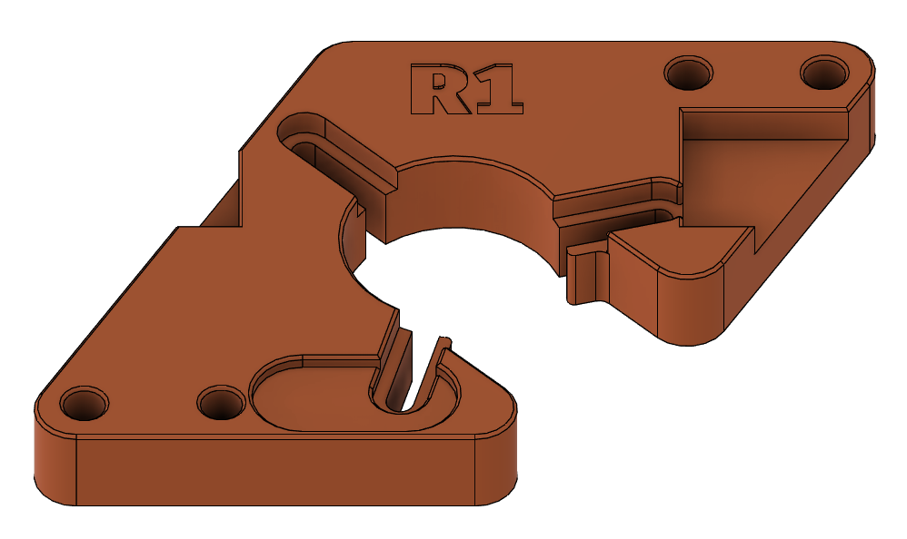

# Generic 3-screw mounting hardware

This directory contains mounting hardware compatible with many 3 screw motors
with hole to hole distances of up to 25mm and M1.6x8 to M2x8 fasteners. If the
wiring output from the motor takes up physical space, it just needs to be
between two of the screws somewhere and it should be fine.

The PCB-side screw holes are sized to allow M3 bolts to thread in, either from
the back if you are just linking boards together, or from the front with longer
screws and nuts on the back if you want to panel mount.

It should be pretty print settings agnostic, but you should probably print it
from at least PETG or other filament with proper heat tolerance as some motors
can get a bit warm for PLA if you're still tuning them or you're driving them
hard.
