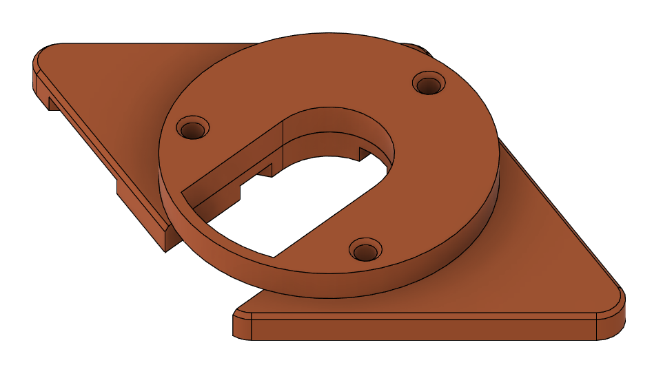

# Generic 3-screw mounting hardware

This directory contains a parametric design compatible with many 3 screw
motors. If the wiring output from the motor takes up physical space, it just
needs to be between two of the screws somewhere and it should be fine.

The PCB-side screw holes are sized to allow M3 bolts to thread in from the
back, through the PCB. Two holes will be available unused in the corners if
you're looking to panel mount.

It should be pretty print settings agnostic, but you should probably print it
from at least PETG or other filament with proper heat tolerance as some motors
can get a bit warm for PLA if you're still tuning them or you're driving them
hard.

motors.csv contains parameter overrides to use with the Fusion 360 script in
IterateSTLs. Note that you will have to hardcode new paths in that python
script for it to work.
